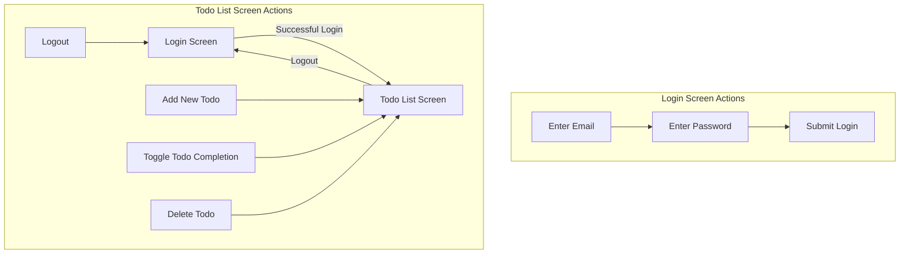

# learn-angular-redux-sample

This project was generated using [Angular CLI](https://github.com/angular/angular-cli) version 19.2.10.

## Screen Flow Diagram



## Screen Descriptions

### Login Screen
- **Enter Email**: Input field for user email
- **Enter Password**: Input field for user password
- **Submit Login**: Button to authenticate user credentials

### Todo List Screen
- **Add New Todo**: Input field and button to create a new todo item
- **Toggle Todo Completion**: Checkbox to mark a todo as complete or incomplete
- **Delete Todo**: Button to remove a todo from the list
- **Logout**: Button to end the current session and return to the login screen

## Development Container

This project includes a devcontainer configuration for Visual Studio Code. The devcontainer provides a consistent development environment with:

- Node.js 20
- Angular CLI pre-installed
- Port 4200 forwarded for the development server
- Root user access

To use the devcontainer:
1. Install the [Remote - Containers](https://marketplace.visualstudio.com/items?itemName=ms-vscode-remote.remote-containers) extension in VS Code
2. Open the project in VS Code
3. Click on the green button in the bottom-left corner and select "Reopen in Container"

## Development server

To start a local development server, run:

```bash
ng serve
```

Once the server is running, open your browser and navigate to `http://localhost:4200/`. The application will automatically reload whenever you modify any of the source files.

## Code scaffolding

Angular CLI includes powerful code scaffolding tools. To generate a new component, run:

```bash
ng generate component component-name
```

For a complete list of available schematics (such as `components`, `directives`, or `pipes`), run:

```bash
ng generate --help
```

## Building

To build the project run:

```bash
ng build
```

This will compile your project and store the build artifacts in the `dist/` directory. By default, the production build optimizes your application for performance and speed.

## Running unit tests

To execute unit tests with the [Karma](https://karma-runner.github.io) test runner, use the following command:

```bash
ng test
```

## Running end-to-end tests

For end-to-end (e2e) testing, run:

```bash
ng e2e
```

Angular CLI does not come with an end-to-end testing framework by default. You can choose one that suits your needs.

## Additional Resources

For more information on using the Angular CLI, including detailed command references, visit the [Angular CLI Overview and Command Reference](https://angular.dev/tools/cli) page.
