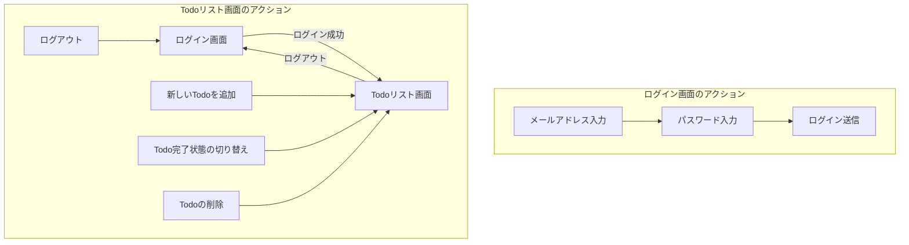
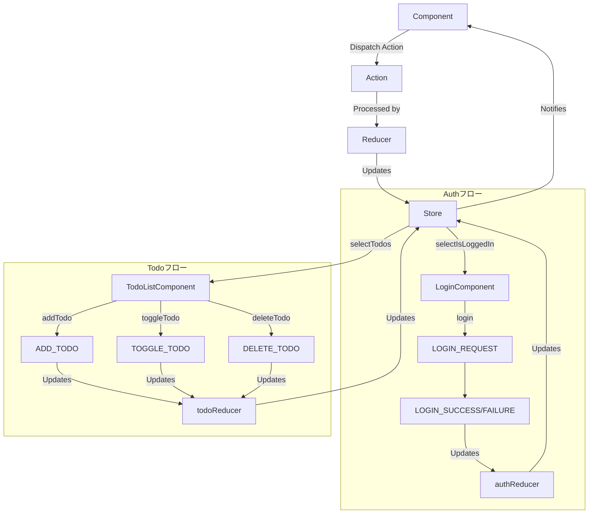

# learn-angular-redux-sample

このプロジェクトは [Angular CLI](https://github.com/angular/angular-cli) バージョン 19.2.10 を使用して生成されました。

## 画面フロー図



## Reduxデータフロー



## Reduxに関連するファイル

### ストア設定
- **src/app/store/index.ts**: Reduxストアの設定ファイル。authReducerとtodoReducerを組み合わせて、アプリケーションのルートストアを作成します。

### 認証関連
- **src/app/store/auth/auth.actions.ts**: 認証に関するアクション（ログイン、ログアウトなど）を定義します。
- **src/app/store/auth/auth.reducer.ts**: 認証状態を管理するリデューサー。
- **src/app/services/auth/auth-store.service.ts**: 認証関連のRedux操作をカプセル化するサービス。

### Todo関連
- **src/app/store/todo/todo.actions.ts**: Todo操作に関するアクション（追加、削除など）を定義します。
- **src/app/store/todo/todo.reducer.ts**: Todo状態を管理するリデューサー。
- **src/app/services/todo/todo-store.service.ts**: Todo関連のRedux操作をカプセル化するサービス。

## 画面説明

### ログイン画面
- **メールアドレス入力**: ユーザーのメールアドレスを入力するフィールド
- **パスワード入力**: ユーザーのパスワードを入力するフィールド
- **ログイン送信**: ユーザー認証情報を送信するボタン

### Todoリスト画面
- **新しいTodoを追加**: 新しいTodoアイテムを作成するための入力フィールドとボタン
- **Todo完了状態の切り替え**: Todoを完了または未完了としてマークするチェックボックス
- **Todoの削除**: リストからTodoを削除するボタン
- **ログアウト**: 現在のセッションを終了してログイン画面に戻るボタン

## 開発コンテナ

このプロジェクトには、Visual Studio Code用のdevcontainer設定が含まれています。devcontainerは以下の機能を備えた一貫した開発環境を提供します：

- Node.js 20
- Angular CLIがプリインストール済み
- 開発サーバー用にポート4200が転送済み
- ルートユーザーアクセス

devcontainerを使用するには：
1. VS Codeに[Remote - Containers](https://marketplace.visualstudio.com/items?itemName=ms-vscode-remote.remote-containers)拡張機能をインストールします
2. VS Codeでプロジェクトを開きます
3. 左下隅の緑色のボタンをクリックし、「コンテナーで再度開く」を選択します

## 開発サーバー

ローカル開発サーバーを起動するには、次のコマンドを実行します：

```bash
ng serve
```

サーバーが起動したら、ブラウザで`http://localhost:4200/`にアクセスしてください。ソースファイルを変更すると、アプリケーションは自動的に再読み込みされます。

## コードスキャフォールディング

Angular CLIには強力なコードスキャフォールディングツールが含まれています。新しいコンポーネントを生成するには、次のコマンドを実行します：

```bash
ng generate component コンポーネント名
```

利用可能なスキーマティック（`components`、`directives`、`pipes`など）の完全なリストを表示するには、次のコマンドを実行します：

```bash
ng generate --help
```

## ビルド

プロジェクトをビルドするには、次のコマンドを実行します：

```bash
ng build
```

これによりプロジェクトがコンパイルされ、ビルド成果物が`dist/`ディレクトリに格納されます。デフォルトでは、本番ビルドはパフォーマンスと速度のためにアプリケーションを最適化します。

## ユニットテストの実行

[Karma](https://karma-runner.github.io)テストランナーでユニットテストを実行するには、次のコマンドを使用します：

```bash
ng test
```

## エンドツーエンドテストの実行

エンドツーエンド（e2e）テストを実行するには：

```bash
ng e2e
```

Angular CLIにはデフォルトでエンドツーエンドテストフレームワークが含まれていません。ニーズに合ったものを選択できます。

## 追加リソース

Angular CLIの使用方法に関する詳細情報（詳細なコマンドリファレンスを含む）については、[Angular CLI概要とコマンドリファレンス](https://angular.dev/tools/cli)ページをご覧ください。
